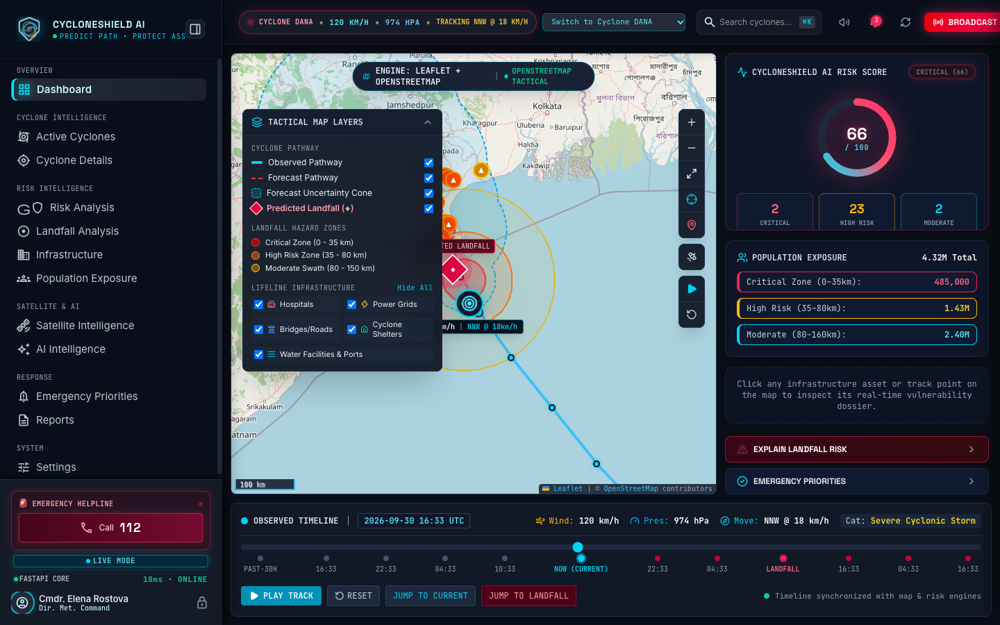
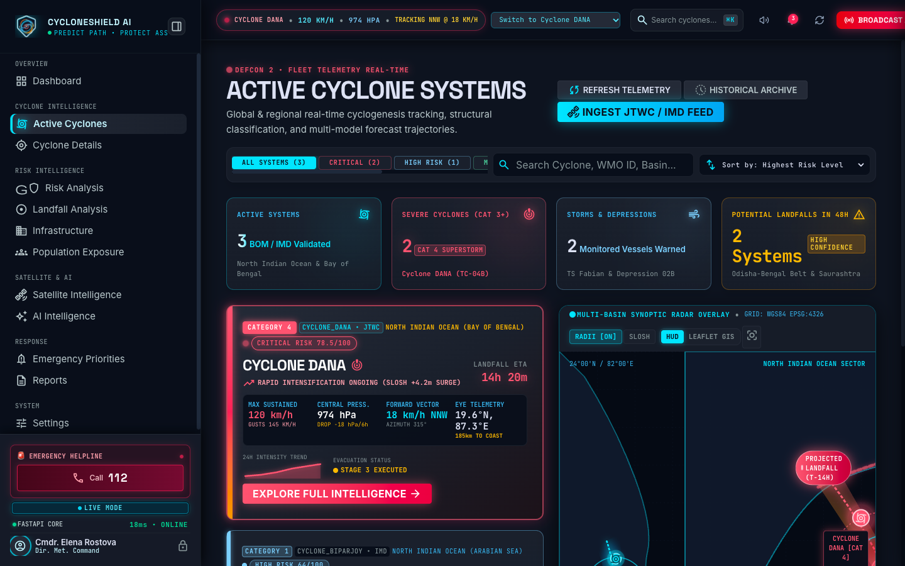
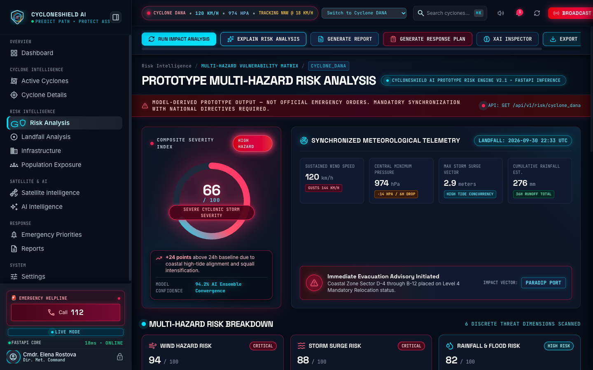
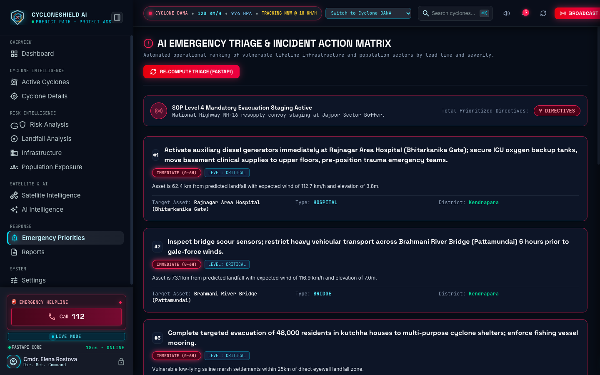

# CycloneShield AI 🌀🛡️
### *Track-Based Cyclone Impact & Infrastructure Vulnerability Forecaster*

> **"Detect the cyclone. Understand its pathway. Predict the impact. Prioritize what is at risk."**

---

## Overview

**CycloneShield AI** is an operational disaster decision-support platform designed for emergency operations centers, humanitarian responders, and municipal disaster authorities. Rather than acting as a simple storm tracking viewer, CycloneShield AI converts real-time meteorological cyclone trajectories, forecast uncertainty envelopes, and numerical landfall models into actionable lifeline infrastructure triage, demographic risk calculations, and automated AI Incident Action Plans.

The system continuously monitors cyclonic disturbances across the North Indian Ocean (Bay of Bengal and Arabian Sea), calculates multi-criteria physical risk indices across critical assets (hospitals, power substations, bridges, water treatment plants, evacuation shelters), and generates prioritized tactical intervention directives before, during, and after landfall.

```
AUTOMATICALLY DETECT CYCLONE
        ↓
WHERE HAS IT BEEN? (Observed Solid Pathway)
        ↓
WHERE IS IT NOW? (Animated Pulsing Eye Marker)
        ↓
WHERE IS IT GOING? (Dashed Forecast Pathway)
        ↓
WHAT IS THE FORECAST UNCERTAINTY? (Expanding Forecast Cone)
        ↓
WHERE COULD IT MAKE LANDFALL? (◆ Predicted Landfall Sector, ETA, Surge)
        ↓
WHAT AREA COULD BE AFFECTED? (Critical 0-35km, High 35-80km, Moderate 80-150km Zones)
        ↓
WHAT INFRASTRUCTURE IS AT RISK? (Hospitals, Power Grids, Bridges, Shelters, Water)
        ↓
HOW MANY PEOPLE ARE EXPOSED? (District-Level Population Aggregation)
        ↓
WHAT SHOULD EMERGENCY TEAMS ANALYZE FIRST? (AI Emergency Priority Action Engine)
```

---

## 📸 Application Screenshots

The following screenshots capture the real, running CycloneShield AI application interface in **LIVE MODE**:

### 1. Main Command Dashboard
Overview showing active storm telemetry, real-time tactical map, key asset vulnerability counters, and multi-tier hazard summaries.



---

### 2. Cyclone Intelligence & Track Visualizer
Live trajectory visualization displaying historical observed track (solid cyan), forward forecast track (dashed rose), expanding forecast uncertainty cone, and interactive timeline playback.



---

### 3. Multi-Criteria Risk Analysis
Asset-level risk scoring and vulnerability matrix showing wind exposure, surge vulnerability, elevation factors, and prototype mitigation actions for hospitals, bridges, and power grids.



---

### 4. Emergency Response & Incident Action Plan
Prioritized tactical triage checklist, demographic exposure metrics, and the prominent Emergency Helpline dock.



---

## 🚨 Emergency Helpline

CycloneShield AI integrates a direct, high-visibility Emergency Helpline in the tactical navigation interface:

```
🚨 EMERGENCY HELPLINE
Call 112
```

- **Emergency Number:** `112` (National Unified Emergency Response Support System - ERSS)
- **Direct Dial Integration:** On supported mobile devices, telephony clients, and softphones, the helpline is clickable via a native `tel:112` link for rapid one-touch emergency escalation.
- **Placement:** Positioned in the primary sidebar dock directly above the **LIVE MODE** operational status indicator, ensuring it remains immediately visible across every screen without obstructing tactical map controls.
- **Responsive Layout:** When the sidebar is collapsed into tactical icon mode, the helpline compresses cleanly into an emergency badge (`🚨 112`) that retains click-to-call functionality.

---

## Current UI

The application features a dark navy tactical command-center interface optimized for emergency operations:

- **CycloneShield AI Branding & Official Group Icon:** Displayed at the top of the sidebar with the authentic blue/orange cyclone-shield emblem directly beside the title and the operational tagline:
  ```
  [GROUP ICON]  CYCLONESHIELD AI
                • PREDICT PATH • PROTECT ASSETS
  ```
- **Clean Tactical Sidebar:** Navigation items are streamlined without clutter. Extraneous status badges have been eliminated, retaining clean icons, section titles, and active route indicators.
- **LIVE MODE Operation:** Operates in verified **LIVE MODE** with real-time state synchronization. Developer latency simulation controls (`DEV: SIMULATE LATENCY`) and simulation mode toggles have been removed from the production interface.
- **Interactive Multi-Tab Command System:**
  - **Command Dashboard:** At-a-glance high-level operational overview.
  - **Active Cyclones / Cyclone Details:** Comprehensive storm parameters, central pressure, maximum sustained wind speeds, and chronological track animation.
  - **Risk Analysis & Landfall:** Multi-criteria risk scoring across lifelines and landfall hazard corridors.
  - **Infrastructure & Population:** Granular asset lists and district population exposure tables.
  - **Satellite & SAR Reconnaissance:** Cloud-penetrating radar flood inundation interpretations.
  - **AI Intelligence & Reports:** Strategic briefings and printable Incident Action Plans.
  - **Emergency Priorities:** Operational checklist ranked by lead-time and physical vulnerability.

---

## Features

### 1. Cyclone Monitoring & Trajectory Modeling
- **Multi-Source Detection Engine:** Ingests storm data from meteorological bulletins, official feeds, and historical catalogs with graceful fallback providers.
- **Observed vs. Forecast Tracking:** Solid cyan lines show confirmed historical positions; dashed rose lines project forecast points.
- **Uncertainty Cone Generation:** Computes expanding Minkowski uncertainty polygons (6h, 12h, 24h, 48h error radii) via Shapely and Turf.js.
- **Timeline Scrubber & Animation:** Chronological play/pause/scrub controls to animate the cyclone's movement over time.

### 2. Landfall & Hazard Zone Computation
- **Landfall Identification:** Predicts landfall point, estimated time of arrival (ETA), sustained wind speeds, and peak storm surge height.
- **Concentric Hazard Zones:** Generates three distinct geographic risk zones:
  - **Critical Zone (0–35 km):** Extreme storm surge and violent structural wind damage swath.
  - **High Risk Zone (35–80 km):** High inundation and power transmission failure swath.
  - **Moderate Swath (80–150 km):** Peripheral flood and gale-force wind corridor.

### 3. Lifeline Infrastructure Vulnerability Assessment
- **Critical Asset Audit:** Evaluates hospitals, electrical substations, bridges, potable water stations, telecommunications towers, and cyclone shelters.
- **Multi-Factor Scoring:** Combines wind velocity, distance to storm track, distance to landfall, ground elevation, and structural fragility into a normalized 0–100 risk score.
- **Tactical Directives:** Automatically suggests engineering mitigation steps (e.g., generator elevation, grid decoupling, flood barrier deployment).

### 4. Demographic & Population Exposure
- **District Aggregations:** Aggregates vulnerable populations across coastal districts (e.g., Bhadrak, Kendrapara, Balasore, Jagatsinghpur).
- **Vulnerability Breakdown:** Classifies exposure into critical, high, and moderate risk categories with evacuation shelter capacity utilization estimates.

### 5. AI Decision Support & Reporting
- **Google Gemini Integration:** Connects to `gemini-2.5-flash` via server-side FastAPI endpoints to synthesize tactical briefings and natural language risk explanations.
- **Deterministic Offline Fallbacks:** When external AI API keys are omitted or networks are disconnected, the system delivers rule-based tactical briefs with zero runtime downtime.
- **Printable Incident Action Plans:** Generates operational reports ready for incident commanders and field teams.

---

## Technology Stack

### Frontend
- **Framework:** React 19 (`react: ^19.2.8`, `react-dom: ^19.2.8`)
- **Language:** TypeScript 6 (`typescript: ~6.0.2`)
- **Build Tool:** Vite 8 (`vite: ^8.3.0`, `@vitejs/plugin-react: ^6.1.1`)
- **Styling:** Tailwind CSS 4 (`tailwindcss: ^4.3.3`, `@tailwindcss/postcss: ^4.3.3`)
- **Mapping:** Leaflet 1.9 (`leaflet: ^1.9.4`, `react-leaflet: ^5.0.0`) with dark tactical tiles
- **Spatial Calculations:** Turf.js (`@turf/turf: ^7.4.0`)
- **Data Visualization:** Recharts (`recharts: ^3.10.1`)
- **State Management:** Zustand 5 (`zustand: ^5.0.15`)
- **Icons:** Lucide React (`lucide-react: ^1.48.0`) & Material Symbols
- **Linter:** Oxlint (`oxlint: ^1.81.0`)

### Backend
- **Framework:** FastAPI (`fastapi>=0.110.0`)
- **ASGI Server:** Uvicorn (`uvicorn[standard]>=0.28.0`)
- **Validation:** Pydantic v2 (`pydantic>=2.0.0`, `pydantic-settings>=2.0.0`)
- **GIS & Geometry:** Shapely (`shapely>=2.0.0`)
- **Data Processing:** NumPy (`numpy>=1.24.0`), Pandas (`pandas>=2.0.0`)
- **Machine Learning:** Scikit-learn (`scikit-learn>=1.3.0`), Joblib (`joblib>=1.3.0`)
- **HTTP Client:** HTTPX (`httpx>=0.27.0`)
- **Language Runtime:** Python 3.9+ (tested on Python 3.9.6 & 3.11)

### AI / ML
- **Machine Learning:** Trained Gradient Boosting Regressor (`ml/models/risk_gradient_boost.joblib`) trained on multi-criteria storm features via `ml/training/train_risk_model.py`.
- **Hazard Scoring Engine:** Operational multi-factor physical vulnerability scoring engine (`backend/app/ml/risk_model.py`).
- **Generative AI:** Google Gemini (`gemini-2.5-flash`) via REST API (`backend/app/ai/gemini.py`) with resilient offline fallback briefing synthesis.

---

## Architecture

CycloneShield AI is structured around a decoupled frontend-backend architecture with a unified single-port runtime option:

```
┌─────────────────────────────────────────────────────────────┐
│                 Client Browser / EOC Dashboard              │
│       React 19 + TypeScript + Tailwind CSS 4 + Leaflet      │
└──────────────────────────────┬──────────────────────────────┘
                               │ HTTP / JSON REST
                               ▼
┌─────────────────────────────────────────────────────────────┐
│                      FastAPI Backend                        │
│                   (Port 8000 / Same Port)                   │
├──────────────────────────────┬──────────────────────────────┤
│ API Routers                  │ Services                     │
│  • /api/cyclones             │  • CycloneDetectionService   │
│  • /api/risk                 │  • CycloneTracker            │
│  • /api/infrastructure       │  • InfrastructureService     │
│  • /api/population           │  • PopulationService         │
│  • /api/map                  │  • MapsService               │
│  • /api/ai                   │  • EmergencyPriorityService  │
│  • /api/health               │  • GeminiService (AI/LLM)    │
├──────────────────────────────┴──────────────────────────────┤
│ Computational Engines                                       │
│  • GIS Spatial Engine (Shapely geodesic cones & swaths)     │
│  • ML Gradient Boosting Regressor (Joblib)                  │
│  • Multi-Criteria Deterministic Hazard Scorer               │
└─────────────────────────────────────────────────────────────┘
```

### Key Architectural Strengths
1. **Unified Single-Port Delivery:** `run.py` serves the built React frontend (`frontend/dist`) and FastAPI API endpoints on the same port (`8000`), eliminating CORS configuration headaches in production.
2. **Strict Route Separation:** API routes (`/api/*`) are registered before SPA routing. Under no circumstance will an API request return HTML.
3. **Resilient AI Pipeline:** If `GEMINI_API_KEY` is not provided or connectivity fails, the AI service seamlessly switches to deterministic emergency briefing synthesis.

---

## Project Structure

```
Cyclone-Detector-main/
├── README.md                      # Complete project documentation
├── requirements.txt               # Backend Python dependencies
├── package.json                   # Root package script runner
├── run.py                         # Single-port application server
├── main.py                        # Standalone FastAPI launcher
├── vercel.json                    # Vercel serverless deployment config
├── render.yaml                    # Render cloud deployment config
├── Procfile                       # Production web process definition
├── .env.example                   # Environment variable template
├── api/                           # Vercel serverless functions
│   ├── index.py                   # Serverless ASGI bridge to FastAPI
│   └── requirements.txt           # Serverless dependency manifest
├── backend/                       # Python FastAPI Backend
│   └── app/
│       ├── main.py                # Application entrypoint & SPA fallback
│       ├── config.py              # Pydantic v2 settings & environment
│       ├── api/                   # REST API routes
│       │   ├── cyclones.py        # Storm detection, tracks, cones, landfall
│       │   ├── risk.py            # Multi-criteria asset & landfall risk
│       │   ├── infrastructure.py  # Lifeline asset queries
│       │   ├── population.py      # Demographic exposure
│       │   ├── maps.py            # GeoJSON map layers
│       │   └── ai.py              # Gemini AI briefings & incident action plans
│       ├── ai/                    # LLM integration & offline fallbacks
│       │   └── gemini.py          # Google Gemini service
│       ├── gis/                   # Spatial algorithms & uncertainty geometry
│       ├── ml/                    # Operational risk scoring models
│       │   └── risk_model.py      # Multi-factor hazard rating algorithms
│       ├── schemas/               # Pydantic data transfer schemas
│       └── services/              # Domain logic & cyclone detection providers
├── frontend/                      # React 19 + TypeScript + Vite Frontend
│   ├── index.html                 # Single page application root
│   ├── package.json               # Node dependencies & build scripts
│   ├── vite.config.ts             # Vite bundler configuration
│   ├── tsconfig.json              # TypeScript compilation settings
│   ├── public/                    # Static assets (icons, logos, favicons)
│   └── src/
│       ├── main.tsx               # React application mounting
│       ├── App.tsx                # Tab router & layout container
│       ├── index.css              # Tailwind CSS 4 theme & custom utilities
│       ├── assets/                # Bundled images & official group icon
│       ├── components/            # Reusable UI components
│       │   ├── Navigation/        # Sidebar (Helpline 112, Live Mode), Header
│       │   └── Map/               # Leaflet tactical map & track visualizers
│       ├── pages/                 # Full-screen command views (12 views)
│       │   ├── Dashboard.tsx      # Overview command center
│       │   ├── Cyclones.tsx       # Storm intelligence & active catalog
│       │   ├── CycloneDetails.tsx # Granular storm parameters & animation
│       │   ├── Analysis.tsx       # Risk analysis & hazard matrix
│       │   ├── LandfallAnalysis.tsx# Coastal landfall impact modeling
│       │   ├── Infrastructure.tsx # Lifeline asset audit
│       │   ├── Population.tsx     # Demographic exposure modeling
│       │   ├── Satellite.tsx      # Satellite & SAR flood reconnaissance
│       │   ├── AIIntelligence.tsx # Strategic briefings & explanation
│       │   ├── Emergency.tsx      # Ranked emergency priority action plan
│       │   ├── Reports.tsx        # Printable incident action plan
│       │   └── Settings.tsx       # Operational parameters & diagnostics
│       ├── services/              # API HTTP client layer
│       ├── store/                 # Zustand global application state
│       └── types/                 # TypeScript data contracts
├── ml/                            # Machine learning artifacts
│   ├── models/                    # Trained model binaries
│   │   └── risk_gradient_boost.joblib # Scikit-learn trained model
│   └── training/                  # Offline training pipelines
│       └── train_risk_model.py    # GradientBoostingRegressor training script
├── cloud/                         # Cloud deployment configurations
│   ├── cloud-run/                 # Google Cloud Run Dockerfiles & service YAML
│   └── vertex-ai/                 # Vertex AI pipeline specifications
├── docs/                          # Project documentation
│   └── screenshots/               # Verified application screenshots
│       ├── dashboard.png          # Main Command Dashboard
│       ├── cyclone-intelligence.png # Cyclone Intelligence & Track Visualizer
│       ├── risk-analysis.png      # Multi-Criteria Risk Analysis
│       └── emergency-response.png # Emergency Response & Incident Action Plan
└── tests/                         # Automated test suite (51 tests)
    ├── test_12_checks.py          # Comprehensive platform verification checks
    ├── test_backend.py            # FastAPI unit & integration tests
    ├── test_cors_and_routes.py    # Route normalization & CORS security tests
    ├── test_live_server.py        # Live server end-to-end integration tests
    └── test_same_port.py          # Unified single-port verification tests
```

---

## Installation

### Prerequisites
- **Python:** 3.9+ (Python 3.11 recommended)
- **Node.js:** v18+ (tested on Node v20/v24)
- **Git**

### 1. Clone Repository & Setup Virtual Environment
```bash
git clone https://github.com/27agnish/Cyclone-Detector.git
cd Cyclone-Detector-main

# Create Python virtual environment
python3 -m venv .venv

# Activate virtual environment
# On macOS / Linux:
source .venv/bin/activate
# On Windows:
# .venv\Scripts\activate

# Install Python dependencies
pip install -r requirements.txt
```

### 2. Install Frontend Dependencies
```bash
cd frontend
npm install
cd ..
```

---

## Environment Variables

Copy the template to create your local environment configuration:
```bash
cp .env.example .env
```

| Variable | Description | Default | Required? |
|---|---|---|---|
| `DEMO_MODE` | Enables synthetic fallback cyclone scenarios if live RSMC/IMD feeds are unreachable | `true` | No |
| `CYCLONE_REFRESH_INTERVAL_MINUTES` | Automatic detection scan interval in minutes | `15` | No |
| `GEMINI_API_KEY` | Google Gemini API key for natural language AI briefings | *None (Fallback active)* | Optional |
| `GEMINI_MODEL` | Gemini model variant | `gemini-2.5-flash` | No |
| `GOOGLE_CLOUD_PROJECT` | Google Cloud project ID (for Vertex AI) | *None* | Optional |
| `GOOGLE_APPLICATION_CREDENTIALS` | Path to Google Service Account JSON | *None* | Optional |
| `CORS_ORIGINS` | Comma-separated list of allowed origins | `https://cyclone-detector.vercel.app,http://localhost:5173` | No |
| `PORT` | Web server port | `8000` | No |

> 🔒 **Security Notice:** CycloneShield AI never exposes API keys or cloud credentials to the client browser. All AI invocations execute strictly server-side through FastAPI.

---

## Running the Project

### Option 1: Unified Single-Port Server (Recommended)
This runs the full application on a single port (`8000`), automatically building the frontend if necessary:

```bash
# Activate virtual environment
source .venv/bin/activate

# Start unified server
python run.py --port 8000
```

- **Web Application:** `http://localhost:8000/`
- **Interactive Swagger Docs:** `http://localhost:8000/api/docs`
- **System Health Status:** `http://localhost:8000/api/health`

### Option 2: Separate Development Servers
If you are developing frontend components with Hot Module Replacement (HMR):

**Terminal 1 — Backend:**
```bash
source .venv/bin/activate
uvicorn backend.app.main:app --host 127.0.0.1 --port 8000 --reload
```

**Terminal 2 — Frontend:**
```bash
cd frontend
npm run dev
```
Open `http://localhost:5173` in your browser (Vite automatically proxies `/api` requests to `http://127.0.0.1:8000`).

---

## API Documentation

FastAPI provides interactive Swagger OpenAPI documentation at `/api/docs`.

### Key Endpoints

| Method | Path | Description |
|---|---|---|
| `GET` | `/api/health` | Comprehensive system health and connected service statuses |
| `GET` | `/api/cyclones` | Returns all registered active, observed, and scenario cyclones |
| `GET` | `/api/cyclones/active` | Filters and returns currently active cyclonic storms |
| `GET` | `/api/cyclones/detect` | Proactively scans feeds to detect new cyclonic disturbances |
| `POST` | `/api/cyclones/refresh` | Forces cache refresh across all detection providers |
| `GET` | `/api/cyclones/{cyclone_id}` | Full package: summary, observed track, forecast track, cone, and landfall |
| `GET` | `/api/cyclones/{cyclone_id}/track` | Chronological track coordinates and animation keyframes |
| `GET` | `/api/cyclones/{cyclone_id}/forecast` | Projected future storm coordinates |
| `GET` | `/api/cyclones/{cyclone_id}/forecast-cone` | GeoJSON polygon geometry representing uncertainty cone |
| `GET` | `/api/cyclones/{cyclone_id}/landfall` | Landfall coordinates, sector name, ETA, wind speed, and storm surge |
| `GET` | `/api/cyclones/{cyclone_id}/landfall-zone` | Critical (35km), High (80km), and Moderate (150km) polygon boundaries |
| `GET` | `/api/risk/{cyclone_id}` | Multi-factor composite risk assessment across all monitored assets |
| `GET` | `/api/infrastructure` | Evaluated lifeline infrastructure assets with computed vulnerability |
| `GET` | `/api/population` | Aggregated population exposure metrics across coastal districts |
| `GET` | `/api/map/cyclone-track` | GeoJSON FeatureCollection of track lines, cones, and nodes |
| `GET` | `/api/map/risk-zones` | GeoJSON FeatureCollection of hazard zone polygons |
| `POST` | `/api/ai/explain-risk` | AI natural-language physical vulnerability explanation for an asset |
| `POST` | `/api/ai/explain-landfall` | AI strategic landfall briefing with meteorological and bathymetric context |
| `POST` | `/api/ai/analyze-satellite` | AI SAR radar flood inundation analysis |
| `POST` | `/api/ai/generate-emergency-plan` | Ranked operational triage checklist for emergency commanders |
| `POST` | `/api/ai/generate-report` | Full AI Disaster Briefing & Incident Action Plan |

---

## AI / ML Architecture

CycloneShield AI integrates three distinct analytic layers:

1. **Offline Trained Machine Learning Model:**
   - **Model File:** `ml/models/risk_gradient_boost.joblib`
   - **Training Script:** `ml/training/train_risk_model.py`
   - **Algorithm:** `GradientBoostingRegressor` (Scikit-learn) trained on historical cyclone telemetry, wind swaths, distance decay, and elevation features to predict composite physical risk scores.
2. **Operational Multi-Criteria Hazard Engine:**
   - **Engine File:** `backend/app/ml/risk_model.py`
   - **Logic:** Real-time multi-factor weighted scoring combining wind velocity, storm surge inundation, rainfall flood potential, landfall distance decay, ground elevation, and asset fragility.
3. **Generative AI Tactical Briefings:**
   - **Service:** `backend/app/ai/gemini.py`
   - **Model:** Google Gemini (`gemini-2.5-flash`) via REST HTTPX integration.
   - **Resilience:** If Gemini API keys are omitted or offline, a deterministic rules-based briefing synthesizer produces structured, domain-accurate Incident Action Plans without errors.

---

## Maps & GIS

- **Mapping Library:** Leaflet 1.9 with `react-leaflet` 5.0.
- **Tile Layer:** CartoDB Dark Matter / OpenStreetMap tactical dark tiles.
- **Spatial Processing:**
  - **Backend:** Shapely 2.0 calculates geodesic buffers, polygon intersections, and expanding forecast cones.
  - **Frontend:** Turf.js performs client-side coordinate interpolation, bearing calculation, and spatial distance measurements.
- **Interactive Layers:**
  - Observed track polyline (solid cyan `#00e5ff`)
  - Forecast track polyline (dashed rose `#f43f5e`)
  - Expanding forecast uncertainty cone polygon
  - Animated pulsing eye marker with real-time telemetry badge
  - Predicted landfall sector diamond marker
  - Concentric landfall hazard zones (Critical 35km, High 80km, Moderate 150km)
  - Color-coded infrastructure markers (Hospital, Power Grid, Bridge, Shelter, Water)

---

## Testing

The automated test suite covers unit logic, GIS calculations, route normalization, CORS policy, and live server endpoints:

```bash
# Run backend pytest suite
source .venv/bin/activate
pytest tests/ -v
```

**Results:** **51 automated tests passing** across 5 test suites:
- `tests/test_12_checks.py`: 12 comprehensive platform compliance checks.
- `tests/test_backend.py`: 15 backend API and GIS calculation tests.
- `tests/test_cors_and_routes.py`: 8 CORS policy and route normalization tests.
- `tests/test_live_server.py`: 15 live server end-to-end integration tests.
- `tests/test_same_port.py`: 1 unified single-port runner verification test.

```bash
# Run frontend checks
cd frontend
npm run lint    # Oxlint (0 errors)
npm run build   # TypeScript compilation & Vite production build
```

---

## Deployment

The project supports multiple deployment architectures:

1. **Unified Single-Port (Render / Railway / VPS / VM):**
   - Packaged with `Procfile` (`web: uvicorn main:app --host 0.0.0.0 --port ${PORT:-8000}`) and `run.py`.
   - `render.yaml` preconfigures a Python 3.11 web service that serves both the API and frontend.
2. **Serverless (Vercel):**
   - Configured via `vercel.json` and `api/index.py`. The built React frontend is deployed as static assets while API routes route to FastAPI serverless functions.
3. **Containerized (Google Cloud Run):**
   - Dockerfile configurations located in `cloud/cloud-run/` with `service.yaml` and Nginx reverse proxy specifications.

---

## ⚖️ Operational Disclaimer

CycloneShield AI is an operational decision-support and research platform designed to assist emergency operations centers and disaster planners. All predictions, risk calculations, hazard zones, and AI incident plans are model-derived estimations. For official warnings, mandatory evacuation orders, and life-safety directives, always consult official bulletins issued by the **India Meteorological Department (IMD)** and the **National Disaster Management Authority (NDMA)**. In life-threatening emergencies, call **112**.
