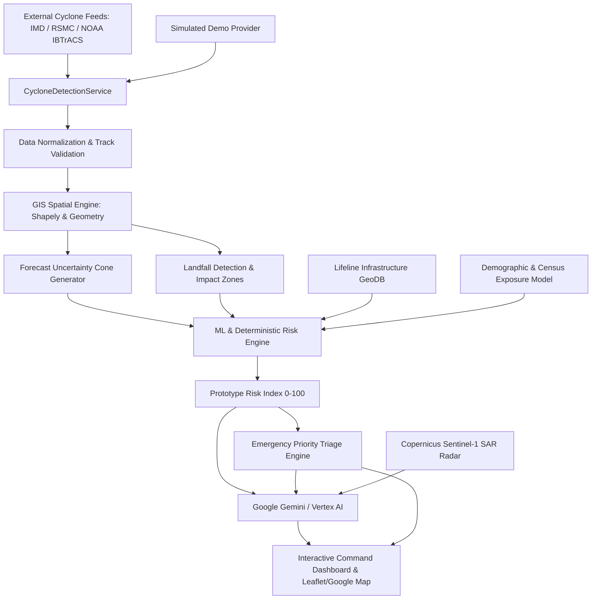

# CycloneShield AI - Architecture & System Design

## 1. System Overview

**CycloneShield AI** is an intelligent disaster-management and geospatial decision-support platform designed to transform cyclone track forecasts into actionable infrastructure protection and population evacuation directives.

## 2. Technology Stack

- **Frontend**: React 18, TypeScript, Vite, Tailwind CSS, Leaflet / Google Maps JavaScript API, Turf.js, Recharts, Zustand, Axios, Lucide Icons.
- **Backend**: Python 3.11, FastAPI, Pydantic v2, Uvicorn, SQLAlchemy, Shapely, NumPy, Pandas, Scikit-learn, HTTPX.
- **AI & ML**: Google Gemini (`gemini-2.5-flash`), Vertex AI pipeline, Gradient Boosting Regressor (`scikit-learn`), parametric Holland/Rankine vortex wind profiles.
- **Cloud & Deployment**: Google Cloud Run, Vertex AI, Earth Engine, Cloud Storage, Artifact Registry, Docker.

## 3. Core Modules

1. **Automatic Cyclone Detection**: Multi-provider fallback chain (`OfficialProvider` -> `IBTrACSProvider` -> `DemoProvider`).
2. **GIS & Spatial Modeling**: Coastline vector intersection for predicted landfall ETA, dynamic Minkowski expanding envelope for forecast uncertainty cones, and concentric impact zones (0-35km Critical, 35-80km High, 80-150km Moderate).
3. **Risk Scoring Engine**: Multi-criteria deterministic composite index calibrated by hazard factors (wind vortex, track proximity, storm surge elevation, asset criticality, rainfall swath).
4. **AI Decision Support**: Google Gemini / Vertex AI natural language synthesis generating tactical hazard briefings, infrastructure mitigation checklists, and Incident Action Plans.
